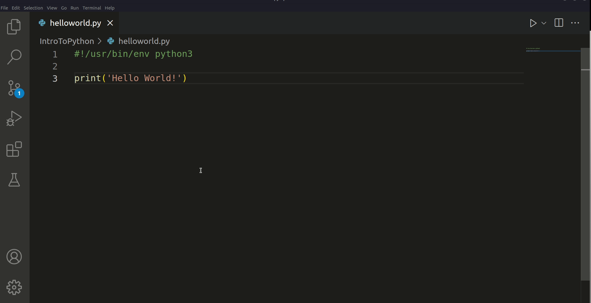

# Python Fundamentals

- Two versions Python 2 and 3
  - Python 3 is the version we will be using

# Python is an interpreted language
> It is compiled every time that it runs

| Advantages                      | Disadvantages |
|---------------------------------|---------------|
|Easier to Debug                  |Slower         |
|Fails immediately when run       |Inefficient    |
|Very portable not dependent on OS|               |

# Two Ways to Execute Python
 1. Real Time Interpreter (REPL)
 2. create *.py file and run in the terminal

# TODO 
 1. At the top of the file `helloworld.py` write this statement
      - `#!/usr/bin/env python3`
      - This is the interpreter line that helps the computer identify the file as a python file
 2. Write this statement on the third line of the file
      - `print('Hello World!')`
      - The print statement will output text to the terminal
 3. Save your code with ctrl+s
 4. Run your code by clicking on the triangle found in the upper right corner of vscode
     / ! 